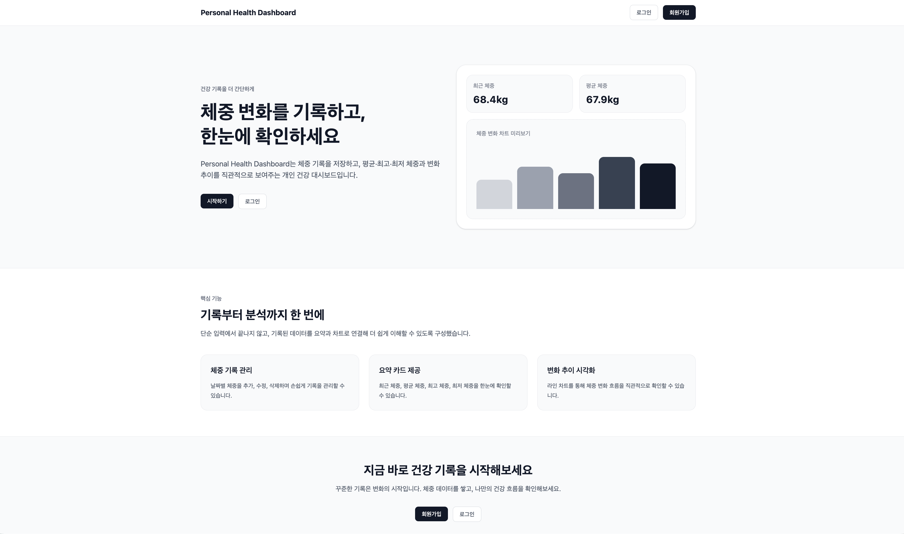
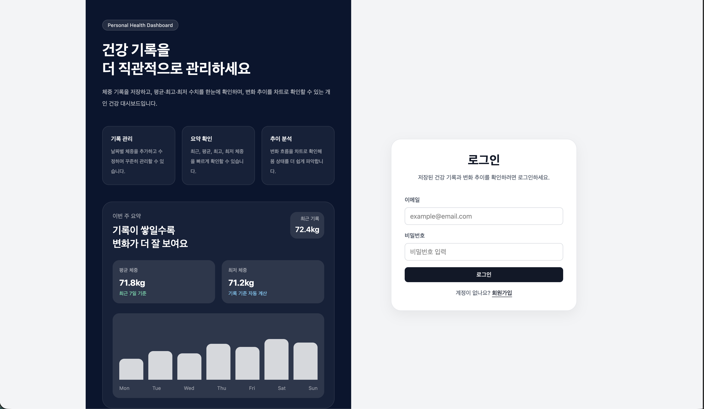
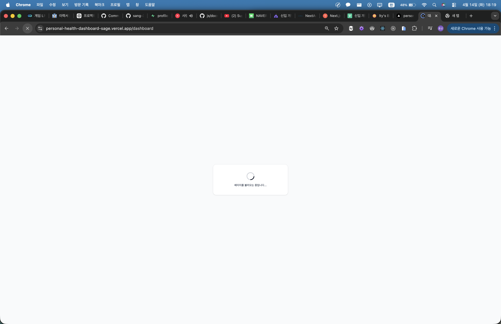
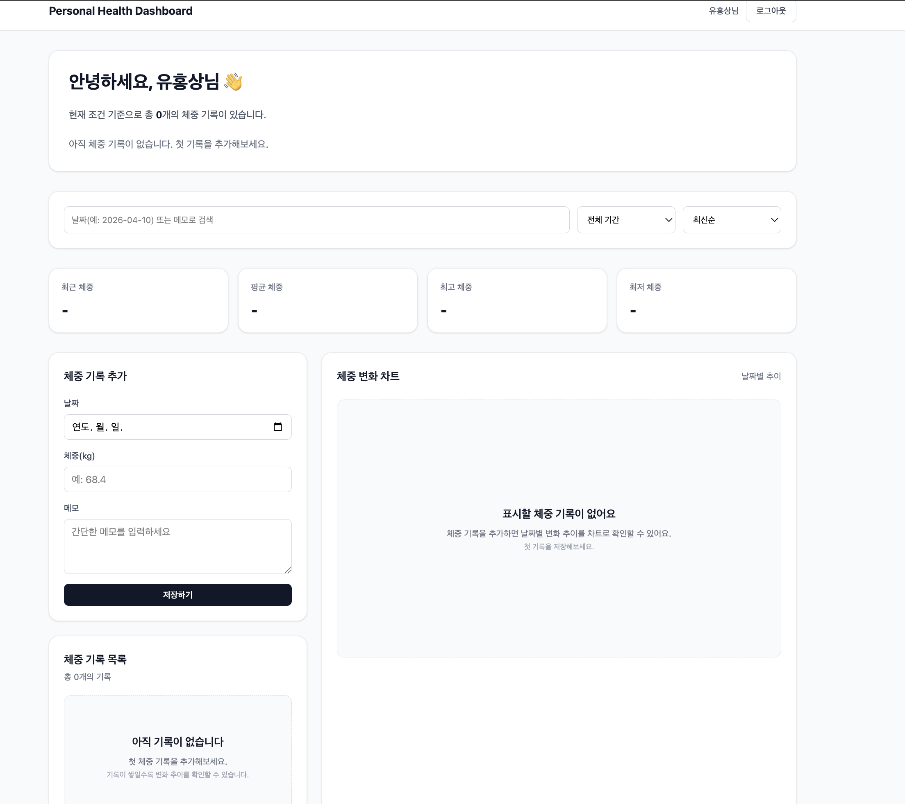
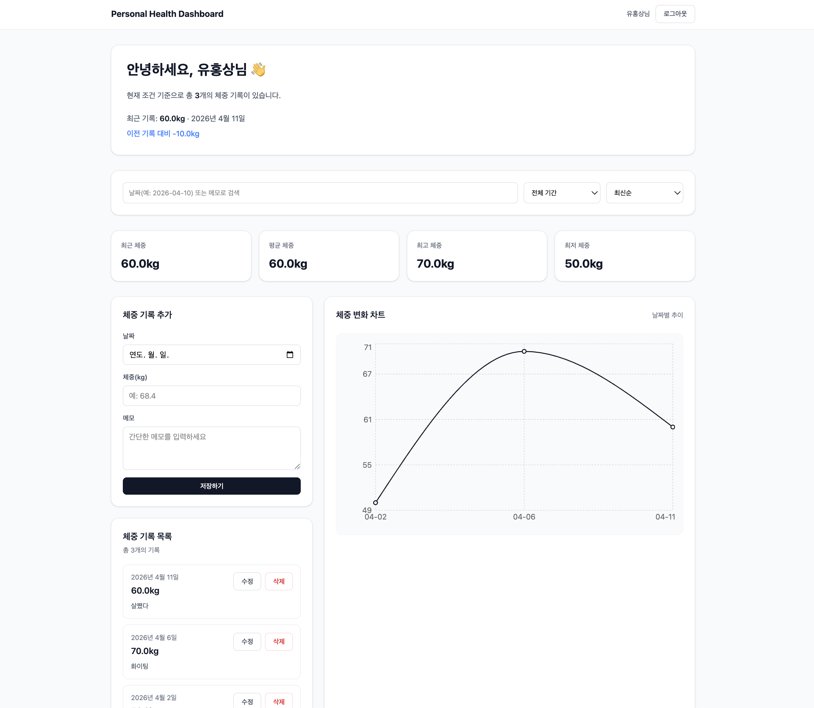
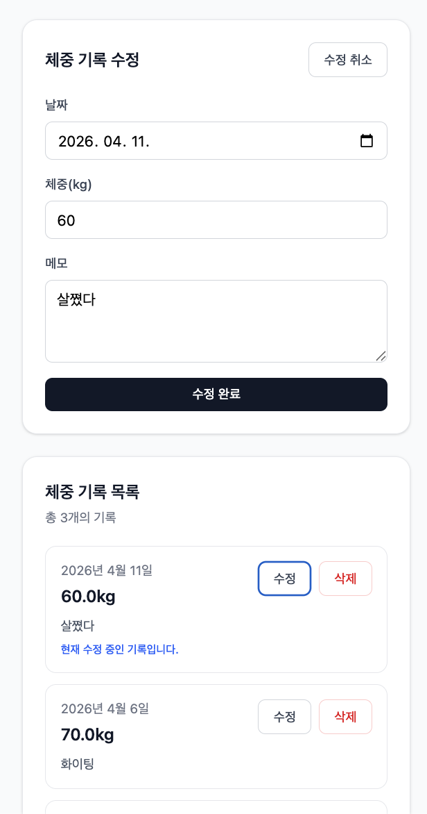

# Personal Health Dashboard

사용자의 건강 데이터를 기록하고, 시각적으로 확인할 수 있는 **개인 건강 대시보드 웹 서비스**입니다.  
체중 기록을 중심으로 건강 데이터를 관리하고, 홈 대시보드에서 요약 정보와 추이를 한눈에 확인할 수 있도록 설계했습니다.

<br>

<table>
  <tr>
    <td></td>
    <td></td>
    <td></td>
  </tr>
  <tr>
    <td></td>
    <td></td>
    <td></td>
  </tr>
</table>

- [배포 링크](https://personal-health-dashboard-sage.vercel.app/)

<br>

## 목차

- [프로젝트 기간](#프로젝트-기간)
- [프로젝트 소개](#프로젝트-소개)
- [개발 목적](#개발-목적)
- [주요 기능](#주요-기능)
- [기술 스택](#기술-스택)
- [프로젝트 구조](#프로젝트-구조)
- [주요 기능 GIF](#주요-기능-gif)
- [트러블슈팅](#트러블슈팅)

<br>

## 프로젝트 기간

- 기간: 2026.03 ~ 2026.04
- 인원: 1명

<br>

## 프로젝트 소개

Personal Health Dashboard는  
사용자의 건강 기록을 단순 저장하는 데서 끝나지 않고,  
**기록 → 요약 → 시각화** 흐름으로 연결해 사용자가 자신의 상태를 더 쉽게 파악할 수 있도록 만든 프로젝트입니다.

단순 CRUD 구현보다도,  
사용자 진입 흐름, 인증 보호, 로딩 경험, UI 안정성 같은  
실제 서비스 사용 경험에 영향을 주는 요소를 함께 고려해 개발했습니다.

<br>

## 개발 목적

- 건강 기록을 직접 입력하고 추이를 시각적으로 확인할 수 있는 서비스 구현
- 인증 기반 라우팅과 데이터 흐름 설계를 경험
- Next.js App Router 환경에서 CRUD, 보호 라우팅, 대시보드 UI 구조 설계 경험

<br>

## 주요 기능

### 1. 인증 기반 접근 제어

- 로그인한 사용자만 대시보드에 접근 가능
- 인증 상태 확인 전 라우팅이 먼저 실행되지 않도록 보호 흐름 설계
- 새로고침 시 세션 복원 이후 사용자 상태 유지
- 회원가입 시 `profiles` 테이블까지 함께 연결되도록 구조 보완

### 2. 체중 기록 CRUD

- 날짜, 체중, 메모 입력
- 체중 기록 추가 / 수정 / 삭제
- 사용자별 체중 기록 분리 관리

### 3. 대시보드 요약 카드

- 최근 체중
- 평균 체중
- 최고 체중
- 최저 체중

### 4. 데이터 시각화

- 체중 변화 추이 차트 제공
- 기록 흐름을 시각적으로 확인 가능
- 기록이 없는 경우 Empty State로 다음 행동 안내

### 5. 로딩 UX 개선

- 데이터 로딩 중 스켈레톤 UI 적용
- 레이아웃이 먼저 잡히도록 설계해 화면 흔들림 최소화

### 6. 인증 폼 UX 개선

- 이메일 형식, 비밀번호 규칙, 비밀번호 확인 검증
- 입력값 검증 에러와 서버 에러 메시지 분리
- 인증 페이지 내 중복 toast 제거

<br>

## 기술 스택

<p>
  
  
  
  
  
    
  
  
</p>
### Frontend

- Next.js (App Router)
- TypeScript
- React
- Tailwind CSS

### Backend / Database

- Supabase

### Chart

- Recharts

### Deploy

- Vercel

<br>

## 프로젝트 구조

```bash
app/
├── (main)/
│   ├── dashboard/
│   │   └── page.tsx
├── (user)/
│   ├── login/
│   │   └── page.tsx
│   ├── signup/
│   │   └── page.tsx
│   └── layout.tsx
├── favicon.ico
├── globals.css
├── layout.tsx
├── loading.tsx
├── not-found.tsx
└── page.tsx

components/
├── auth/
│   ├── AuthCard.tsx
│   ├── LoginForm.tsx
│   └── SignupForm.tsx
├── dashboard/
│   ├── DashboardHeader.tsx
│   ├── EmptyState.tsx
│   ├── SummaryCard.tsx
│   ├── WeightChart.tsx
│   ├── WeightForm.tsx
│   ├── WeightList.tsx
│   └── WeightSection.tsx
├── landing/
│   ├── FeatureSection.tsx
│   ├── HeroSection.tsx
│   ├── LandingHeader.tsx
│   └── StartSection.tsx
└── ui/
    ├── Button.tsx
    ├── Input.tsx
    └── Textarea.tsx

actions/
├── auth.ts
└── weight.ts

lib/
├── profile.ts
├── supabase/
│   ├── client.ts
│   └── server.ts
├── validations/
│   └── auth.ts
├── utils.ts
└── weight.ts

types/
├── auth.ts
├── index.ts
├── profile.ts
└── weight.ts
```

<br>

## 트러블슈팅

### 1. 새로고침 시 로그인 리다이렉트 문제 해결

#### 문제 상황

새로고침 시 로그인 상태임에도 로그인 페이지로 이동하는 문제가 있었습니다.

#### 원인

초기 렌더링 시 사용자 세션이 복원되기 전에 보호 라우팅 판단이 먼저 실행되면서, 인증 여부가 확정되지 않은 상태에서 리다이렉트가 발생하고 있었습니다.

#### 해결 방법

인증 확인이 완료되기 전까지는 보호 라우팅 판단을 지연하도록 구조를 분리했습니다.  
세션 복원 이후에만 접근 제어가 실행되도록 흐름을 재정리해, 인증 상태가 안정적으로 확정된 뒤 페이지 이동이 일어나도록 수정했습니다.

#### 결과

새로고침 이후에도 로그인 상태가 정상적으로 유지되었고, 사용자가 의도하지 않은 로그인 페이지 이동 문제를 해결할 수 있었습니다.

#### 배운 점

인증이 필요한 화면에서는 “로그인 여부 판단”보다 “인증 상태가 확정되었는지”를 먼저 구분해야 한다는 점을 배웠습니다.  
보호 라우팅은 단순 조건문이 아니라, 세션 복원 타이밍까지 고려해야 안정적으로 동작한다는 점을 경험했습니다.

---

### 2. `auth.users`와 `profiles` 분리 구조에서 사용자 정보 누락 문제 해결

#### 문제 상황

회원가입은 정상적으로 동작했지만, 앱에서 사용하는 `profiles` 테이블에는 사용자 정보가 저장되지 않는 문제가 있었습니다.

#### 원인

초기 회원가입 로직은 `supabase.auth.signUp()`만 호출하고 있었고, 이 과정에서는 `auth.users`에만 계정이 생성되었습니다.  
즉 인증 계정은 만들어지지만, 앱에서 사용하는 사용자 정보 테이블과 연결되는 후속 로직이 없었습니다.

#### 해결 방법

회원가입 성공 후 `upsertProfile()`을 호출해 `profiles`에 `id`, `email`, `name`을 함께 저장하도록 수정했습니다.  
또한 기존 계정 중 `profiles`가 누락된 경우를 대비해, 대시보드 진입 시 `ensureProfile()`로 프로필을 자동 복구하는 로직도 추가했습니다.

#### 결과

이후 회원가입 시 인증 계정과 앱 사용자 정보가 함께 생성되도록 정리할 수 있었고, 누락된 프로필 데이터도 안정적으로 복구할 수 있는 구조가 되었습니다.

#### 배운 점

Supabase에서는 인증 계정(`auth.users`)과 앱 전용 사용자 정보(`profiles`)를 분리해 관리하는 구조가 흔하다는 점을 이해하게 되었습니다.  
인증과 사용자 정보의 역할을 명확히 분리하면 구조가 더 설명 가능해지고, 이후 설정 기능이나 목표 체중 같은 사용자 확장 정보도 자연스럽게 연결할 수 있다는 점을 배웠습니다.

---

### 3. 인증 에러 메시지 UX 개선

#### 문제 상황

로그인·회원가입 화면에서 필드별 에러, toast, 상단 공통 문구가 동시에 표시되면서 사용자가 어떤 값을 먼저 수정해야 하는지 직관적으로 파악하기 어려웠습니다.

#### 원인

입력값 검증 실패와 서버/인증 실패를 같은 방식으로 처리하고 있었고, 에러 메시지를 여러 위치에 중복 노출하고 있었습니다.  
그 결과 에러의 원인과 수정 위치가 명확히 구분되지 않았습니다.

#### 해결 방법

에러를 두 가지로 분리했습니다.  
입력값 검증 실패는 각 필드 아래에 표시하고, 실제 서버 실패나 인증 오류는 상단 공통 에러 영역에만 표시하도록 구조를 재정리했습니다.  
추가로 인증 페이지에서는 toast를 제거해 중복 피드백을 줄였습니다.

#### 결과

사용자는 입력 오류를 해당 필드에서 바로 확인할 수 있게 되었고, 서버 에러와 입력 에러가 명확히 구분되어 인증 흐름의 가독성과 사용성이 개선되었습니다.

#### 배운 점

에러 메시지는 많이 보여주는 것보다, 어떤 종류의 에러를 어디에 보여줄지 역할을 분리하는 것이 더 중요하다는 점을 배웠습니다.  
특히 인증 폼에서는 인라인 피드백과 서버 에러 영역의 역할을 나누는 것이 사용자 경험에 큰 영향을 준다는 점을 확인했습니다.
